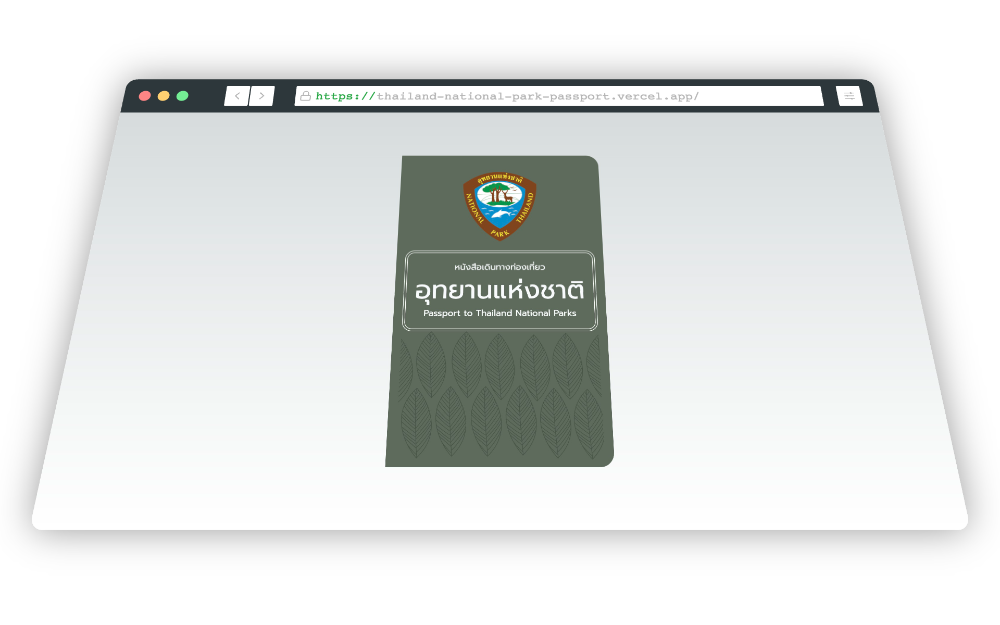

# Thailand National Park
[The Thailand National Park Passport](https://thailand-national-park-passport.vercel.app/) Project aims to collect data on the national parks in Thailand. The project is inspired by the real Thailand National Park Passport issued by The National Parks Association of Thailand.
<!-- PROJECT LOGO -->

  

# Data Sources
- Google Sheet
➡️ [Thailand national park Data](https://docs.google.com/spreadsheets/d/1LndYT5VX8lZQsjtQko5yoky9ri_UkXEmiGY__QIN_Bk/edit?usp=sharing)

- CSV
➡️ [thailand_national_park.csv](https://docs.google.com/spreadsheets/d/e/2PACX-1vQFUHODCeW0tq-ZAvJb6PoWxPBntEKaI3inZuOqL99EQAWrPl01Cs0v2jZPvXY8mCRPwi2G4lk1OuB6/pub?gid=125491161&single=true&output=csv)
- JSON
➡️ [thailand_national_park.json](https://raw.githubusercontent.com/wiki/anuwatavis/thailand-national-park-passport/thailand_national_park.json)
  

# Acknowledgements
[National park in thailand](https://portal.dnp.go.th/Content/nationalpark?contentId=24757)
